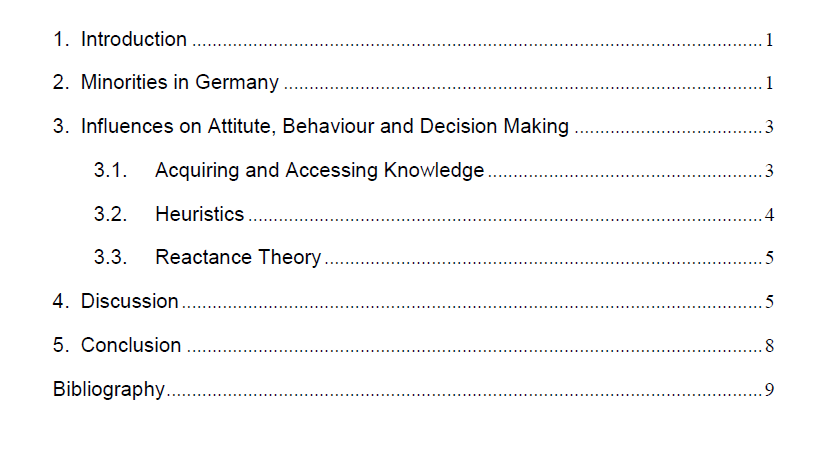

In times where (social) media is part of every day life, aswell as an important tool of education, the demand for equal representation of minorities in the media rises.
A 2011 swiss study found that there was a high descripancy in perceptions of representation and participation between migrants. While some subjects – migrants themselves – felt that they were standing in the spotlight, creating a too obvious display of the minority, others felt there was not enough representation. Broadcasting companies like the BBC have already published future goals and „on-air portrayal targets“ regarding their representation of minorities in TV-shows and general broadcast. The long term expectation: To further equality, showing that minorities are a normal part of society thus deminishing prejudice.

This essay discusses the idea of implementing quotas by law in order to establish equality of representation in German media, ultimately answering the question: *Should media, such as newspapers, TV or radio be obliged to improve the representation of minority groups, for example by introducing quotas?*

Find the complete essay **[here](Assignment Minorities in the Media - Nora Theresa Koch.pdf).**

