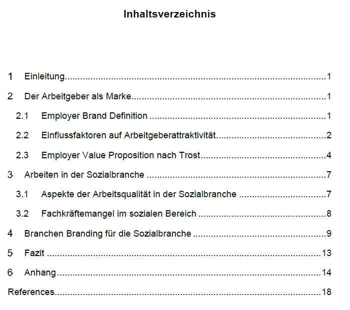

In Zeiten, in denen die Begriffe Fachkräftemangel und War for Talent deutsche Unternehmen in Angst und Schrecken versetzten, wird nach Wegen gesucht, qualifizierte und interessierte potentielle MitarbeiterInnen zu gewinnen und langfristig zu binden. Spezialisierte Fachkräfte sind gefragt und dementsprechend in der Position, sich aus den vorhandenen Angeboten das Beste aussuchen. Daher wird vor allen Dingen in Bereichen, in denen spezielle Kenntnisse gefordert, und in Zukunft ein hoher Bedarf an Personal bestehen wird, am Personalmarketing (und damit einhergehend dem Arbeitgeberimage) gearbeitet.

Dazu stellt sich die Frage: Welche Möglichkeiten gibt es, die Attraktivität als Arbeitgeber zu steigern? Wie kann ein Unternehmen eine Arbeitgebermarke entwickeln um so auf dem Arbeitsmarkthervorstechen? **Ist es möglich das Konzept der Arbeitgebermarke auf eine komplette Branche zu übertragen?**

Meine Arbeit zur Implementierung einer Branchenmarke in der Sozialbranche finden Sie [hier](Vom Employer Branding zum Branchen Branding .pdf).

