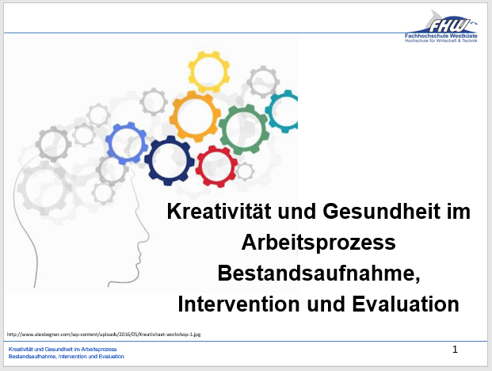

Kritische Betrachtung der Studie "Kreativität und Gesundheit im Arbeitsprozess: Bestandsaufnahme, Intervention und Evaluation", entstanden aus einer Kooperation der *Bundesanstalt für Arbeitsschutz und Arbeitsmedizin* und dem *Bundesminsterium für Arbeit und Soziales*.

Die Studie finden Sie [hier](Studie.pdf), gemeinsam mit unserer [Kritik der Studie](Arbeitsanalyse Präsentation.ppt).

